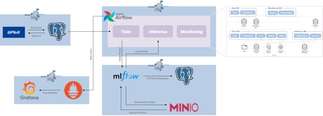

# MLOps_Docker

## Docker Compose

1. **Airflow**
    - Workflow 실행 및 관리
    - 컨테이너 생성 후 MinIO Client 설정 필요. `$ bash ./bash/set_mc_in_airflow_worker.sh`, `$ bash ./bash/set_minio_in_airflow_worker.sh`
    
2. **MLFlow**

3. **PostgreSQL**

4. **MinIO**

5. **Prometheus**

6. **Grafana**
